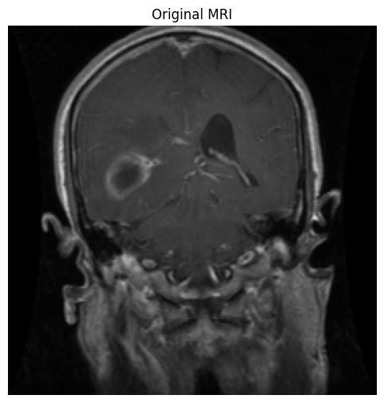
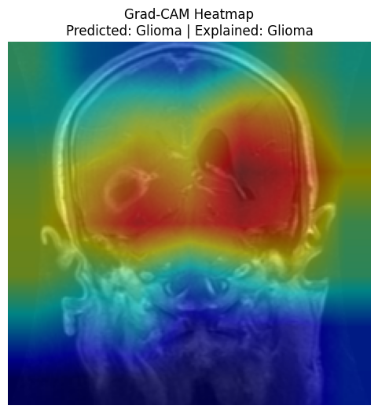
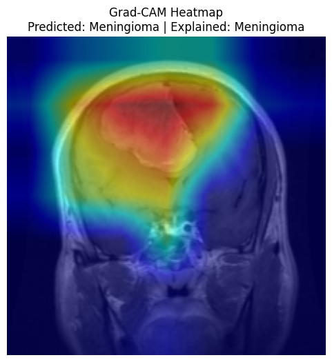
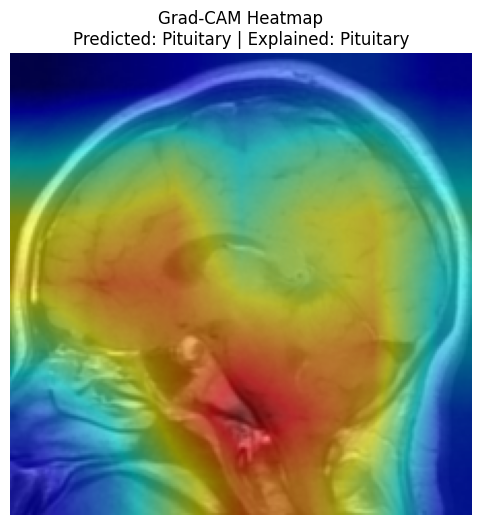
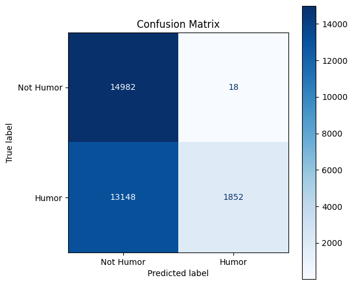
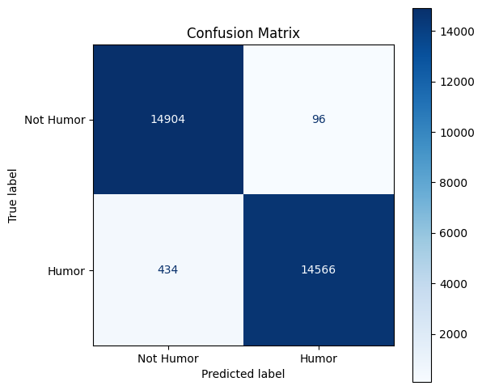
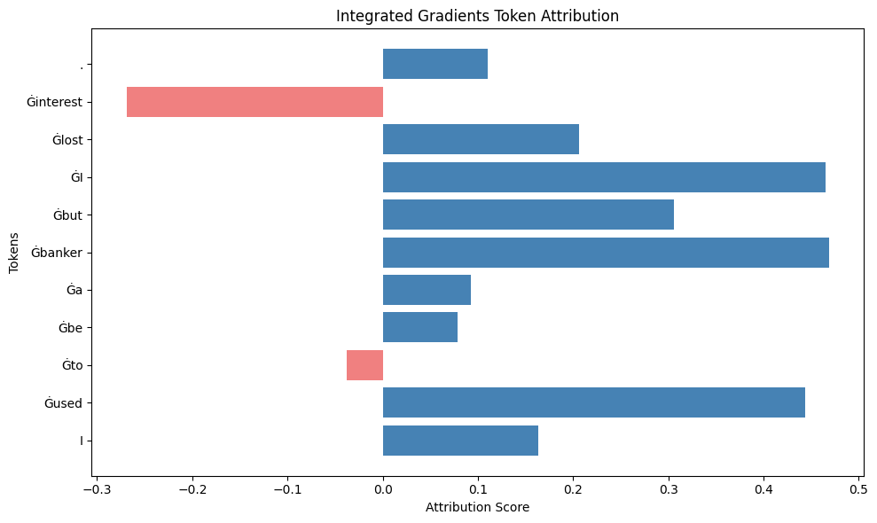
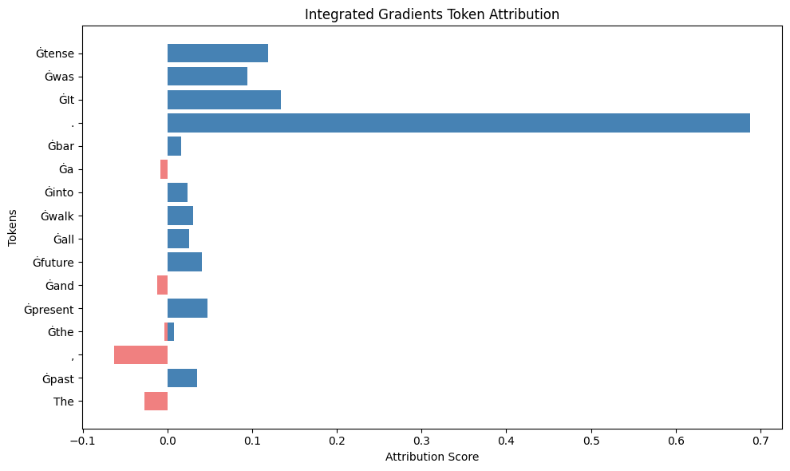
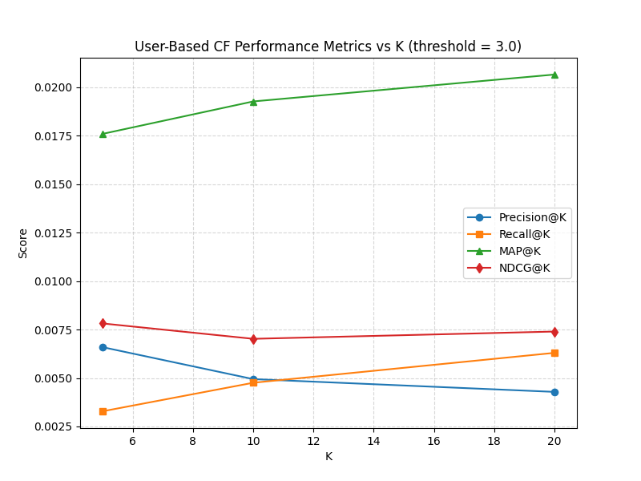
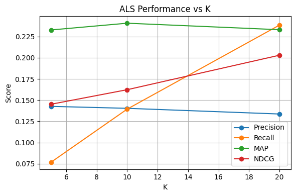

# Brendan Lauterborn

Data Scientist — Baltimore, MD
brendan.lauterborn@gmail.com | [github.com/brendanglauterborn](https://github.com/brendanglauterborn)

## Education

M.S. Computer Science — Data Science, Towson University
B.S. Applied Mathematics, Texas A&M University

## Work Experience

### Data Science Intern — CPower (an NRG Company), 06/2026 – Present
- Ingested hourly utility meter data across 1,200 CAISO sites (~5M+ readings) via PySpark in Microsoft Fabric into a Delta Lake table
- Built statistical data quality scoring to detect outliers, flatlines, zeros, and nulls at scale, assigning account and monthly health grades
- Built a full-stack analytics dashboard (FastAPI + React) used by the Enrollment Settlements and Payments team
- Trained a multi-output XGBoost model on engineered time/lag features to predict kW usage and detect anomalies for 200 CAISO target accounts
- Combined ML predictions with rule-based logic to build an anomaly detection system for customer load curtailment, speeding up payout processing

### Graduate Teaching Assistant — Towson University, Dept. of Computer Science, 01/2026 – 05/2026
- Assisted teaching Data Structures and Object-Oriented Programming (Java); evaluated and debugged student code

### Business Intelligence Developer Intern — CPower, 06/2025 – 08/2025
- Built Python data quality scripts validating CRM data (Microsoft Dynamics 365), flagging ~8.5% of leads as low quality
- Implemented fuzzy matching to detect ~250 duplicate accounts across Dataverse and SharePoint

## Projects

### Brain Tumor Classification with Explainable AI

Brain tumors are typically diagnosed from MRI scans, a process that relies heavily on radiologist judgment and can benefit from automated, interpretable support tools. In this project, I built a custom convolutional neural network in PyTorch to classify tumor type from MRI images, then improved performance by applying DenseNet-121 transfer learning, raising accuracy from 79% to 88%. To make the model's decisions interpretable, I applied Grad-CAM to generate class activation heatmaps highlighting the MRI regions driving each prediction.

| Original MRI | Grad-CAM |
|---|---|
|  |  |
|  |  |
|  |  |

DenseNet121 improved meningioma classification the most, the class the custom CNN struggled with — F1 rose from 0.58 to 0.77 as recall improved from 0.53 to 0.79.

| Custom CNN | DenseNet121 Transfer Learning |
|---|---|
|  |  |

  

[View code on GitHub](https://github.com/brendanglauterborn/brain-tumor-mri-classification-xai).

---

### Humor Detection with Explainable AI

Humor is notoriously hard for models to detect because it depends on context, ambiguity, and wordplay that simple keyword or sentiment approaches miss. In this project, I fine-tuned a RoBERTa transformer to classify text as humorous or non-humorous, taking accuracy from a 56% baseline to 98% after fine-tuning. I then applied Captum's Integrated Gradients to attribute each prediction back to specific tokens, and built a full-stack app in FastAPI and React so users can submit their own text and see real-time predictions alongside the token-level explanations.

| Baseline RoBERTa | Fine-Tuned Model |
|---|---|
|  |  |

Integrated Gradients highlighted which tokens drove each prediction — for "I used to be a banker but I lost interest," words like "banker," "used," and "lost" pushed the model toward humorous, showing it leans on contextual interaction between tokens rather than any single word.

The model also picked up on structural cues, not just semantics — for "The past, the present and the future all walk into a bar. It was tense," the abrupt period and the words following it carried strong positive attribution.

    

[View code on GitHub](https://github.com/brendanglauterborn/Humor-Detection-with-XAI).

---

### CNN-Based Dog Breed Classification and Human-Dog Mapping

This project explores how well a CNN can generalize fine-grained visual classification, using dog breeds as a proxy for a task humans find intuitive but is genuinely hard at scale. I built a model that detects whether an image contains a human or a dog, classifies the dog's breed across 133 categories, and maps human faces to their closest-matching breed. Replacing the baseline CNN with DenseNet-161 transfer learning took accuracy from roughly 13% to 86%.

 

[View code on GitHub](https://github.com/brendanglauterborn/cnn-dog-breed-classifier).

---

### Netflix Customer Churn Prediction

*Predicting who cancels from 5,000 subscriber records.*

Netflix wants to know which subscribers are about to leave. I framed this as binary classification on the Kaggle Netflix Customer Churn dataset (5,000 customers, 13 features covering usage, plan, payment, and demographics) and compared Logistic Regression, SVM, and Random Forest on a 70/30 split. I also reviewed prior churn studies and found that both relied on self-reported surveys, which measure intent to leave and carry self-selection bias, rather than actual churn.

#### Results

| Model | Accuracy | F1 | AUC |
|---|---|---|---|
| Logistic Regression | .909 | .907 | .974 |
| SVM | .905 | .903 | .969 |
| Random Forest | .989 | .988 | .999 |

#### Key Finding

Random Forest reached 98.9% accuracy versus about 91% for the linear models, which was suspicious enough that I dug into feature importance. Inactivity signals (watch hours, avg watch time per day, last login days) dominated, along with number of profiles and payment method. Logistic regression agreed: those features were significant at p < .01. Activity was the strongest churn predictor, consistent with the business intuition that disengaged users leave.

*Left: permutation importance (mean decrease in accuracy). Right: mean decrease in Gini. Both put inactivity features and number of profiles at the top.*

   

[View code on GitHub](https://github.com/brendanglauterborn/Big-Data-Classification).

---

### MovieLens Recommender System: User-Based CF vs. ALS Matrix Factorization

*Building two recommenders on MovieLens and testing whether latent factors beat neighbors on sparse data.*

Streaming platforms have far more content than anyone can browse, so personalization drives engagement. I built two recommenders on the MovieLens latest-small dataset (about 100,000 ratings, 600 users, 9,000 movies) and compared them with ranking metrics on an 80/20 train/test split.

- **User-based Collaborative Filtering (baseline):** cosine similarity between mean-centered user ratings, k = 50 neighbors, ratings predicted as the user's mean plus a similarity-weighted average of neighbors' deviations from their own means.
- **ALS Matrix Factorization:** the user-item matrix factorized into user and item latent factors, using the `implicit` library (20 factors, 20 iterations, regularization 0.1, confidence weight α = 15).

#### Results

| Metric | User-based CF (K=5 → 20) | ALS (K=5 → 20) |
|---|---|---|
| Precision@K | .0066 → .0043 | .142 → .133 |
| Recall@K | .0033 → .0063 | .077 → .239 |
| MAP | .0176 → .0207 | .2328 → .2331 |
| NDCG | .0078 → .0074 | .145 → .203 |

User-based CF also had an RMSE of 0.876 over 19,347 test ratings.

##### User-based CF (relevant = rating ≥ 3.0)

##### ALS Matrix Factorization

#### Key Finding

ALS beat user-based CF on every ranking metric. At K=5, ALS precision was 14.2% versus 0.66% for the baseline. MovieLens is sparse, so most user pairs share very few rated movies, which weakens neighbor-based similarity. Latent factors can pick up structure that neighbors miss. Precision fell slightly as K grew for both models, while recall rose, which is the expected tradeoff. ALS recall reached 23.9% by K=20.

#### Limitations and Next Steps

- Random 80/20 split of ratings rather than a per-user or time-based split.
- Cold start (new users with no history) is a known weakness of both approaches and was not evaluated.
- Next: content-based filtering and deep learning approaches.

   

[View code on GitHub](https://github.com/brendanglauterborn/Big-Data-Recommender-Sys).

---

### Natural Language to SQL — LLM Prompt Engineering

As LLMs get used more often to translate natural language questions into executable SQL, understanding where and why they fail becomes important for anyone relying on them in production. In this project, I used the OpenAI API to run controlled prompt-engineering experiments — zero-shot, few-shot, and chain-of-thought — measuring how each strategy affected query accuracy. The results quantified clear accuracy tradeoffs between approaches and surfaced common failure modes in LLM-generated SQL.

  
